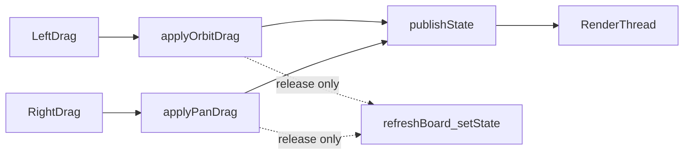

# Viewport Pan / Flicker / Layout Implementation Plan

> **For agentic workers:** Follow this plan task-by-task. Steps use checkbox (`- [ ]`) syntax for tracking.

**Goal:** Stop left-drag flicker for good, add right-button pan of the 3D view, and lightly loosen the rigid dock layout (collapsible sections + better default dock sizes).

**Architecture:** Keep Qt docks + HWND DX11 viewport + `std::thread` renderer with owner-thread swapchain. Teaching camera gains an orbit **target**; drag interaction no longer refreshes matrix boards until mouse release.

**Tech Stack:** C++11, Qt 5.15 Widgets, D3D11, DirectXMath.

**Related:**
- Design: [`docs/superpowers/specs/2026-08-16-dx11-lab-teach-design.md`](../specs/2026-08-16-dx11-lab-teach-design.md)
- Prior polish: [`docs/superpowers/plans/2026-08-16-viewport-polish.md`](./2026-08-16-viewport-polish.md)
- UI layout notes: [`docs/ui/01-lab-shell-layout.md`](../../ui/01-lab-shell-layout.md)

## Global Constraints

- Do not change teaching state machine core, row/column-major upload rules, or render-thread model (owner-thread swapchain create/resize/destroy).
- Prefer right-button pan (user request). Layout doc previously said middle-button; this plan supersedes that to **右键平移**.
- Local commits per task; push when the pass finishes (or per user preference).

## Root causes

| Symptom | Cause |
|---------|--------|
| Left-drag still flickers | Every 50 ms `teachingEdited` → `onTeachingEdited` still runs `refreshBoard()` + multi-panel `setState`, rewriting matrix `QPlainTextEdit`s → dock reflow → 1 px viewport resize |
| No pan | `BuildView` always looks at origin (`XMVectorZero`); no `camTarget` / pan drag |
| Layout feels rigid | Many docks at once, non-collapsible group boxes, weak default dock sizing |

---

### Task 1: Stop drag flicker (UI sync only on release)

**Files:**
- Modify: `src/ui/Dx11ViewportWidget.h` / `.cpp`
- Modify: `src/app/MainWindow.cpp` / `.h` (only if signal contract needs a flag; prefer viewport-side silence)

- [ ] **Step 1:** Interaction state: `Idle` / `Orbiting` / `Panning` (or `m_orbiting` + `m_panning`).
- [ ] **Step 2:** While dragging: only `publishState` for GPU; **do not** `emit teachingEdited` (remove or bypass the 50 ms throttle emit path during drag).
- [ ] **Step 3:** On LMB/RMB release: stop grab, then `emit teachingEdited` once so Transform / Matrix / Tracker sync.
- [ ] **Step 4:** Keep existing no-op `resize` skip and matrix edit min height.
- [ ] **Step 5:** Manual: left-drag — no black flash; release — sliders/matrices match camera.
- [ ] **Step 6:** Commit: `Stop matrix board refresh during viewport drag to prevent flicker.`

---

### Task 2: Right-button pan (screen-space)

**Files:**
- Modify: `src/core/TeachingState.h` (`camTarget[3]`, `applyPanDrag`)
- Modify: `src/teach/Transforms.h` / `.cpp` (`BuildView` takes target)
- Modify: `src/ui/Dx11ViewportWidget.cpp` (RMB drag)
- Modify: `src/ui/TransformPanel.cpp` / `.h` (show/edit target; optional but preferred for teaching)
- Modify: `src/teach/JsonIo.cpp` (read/write `camTarget`, default origin if missing)
- Modify: `src/app/MainWindow.cpp` (reset clears target; any `BuildView` call sites)
- Modify: `src/render/D3D11Renderer.cpp` (BuildView call sites)
- Modify: tests under `tests/` if view/JSON expectations change

- [ ] **Step 1:** Add `camTarget[3]` default `{0,0,0}` to `TeachingState` / defaults / reset.
- [ ] **Step 2:** `BuildView(distance, pitch, yaw, target)`: `eye = target + sphericalOffset`, `XMMatrixLookAtLH(eye, target, up)`.
- [ ] **Step 3:** `applyPanDrag`: grab-the-world pan (content follows the cursor, 3ds Max style). Move `camTarget` along camera right/up, scaled by `camDistance / viewportH`. Signs: `moveR = -dx * scale`, `moveU = dy * scale` (`dy` is Qt screen-space, down positive). Camera therefore moves opposite the mouse so the scene sticks to the cursor.
- [ ] **Step 4:** Viewport: RMB press → pan mode + `grabMouse`; move → pan; release → UI sync (Task 1 path). LMB still orbits around **current target**. Wheel still changes distance.
- [ ] **Step 5:** JSON round-trip `camTarget`; missing key → origin (compat).
- [ ] **Step 6:** Transform View section: Target X/Y/Z (editable or display + drag).
- [ ] **Step 7:** Manual: RMB pans; LMB orbits about new target; Reset zeros target.
- [ ] **Step 8:** Commit: `Add camera target and right-button pan for the viewport.`

---

### Task 3: Light layout looseness

**Files:**
- Modify: `src/app/MainWindow.cpp` (dock default sizes via `resizeDocks`)
- Modify: `src/ui/TransformPanel.cpp` (and Object panel groups if present): checkable/collapsible `QGroupBox`
- Modify: `src/app/app.qss` (tighter dock titles / less rigid min-heights)
- Modify: `docs/ui/01-lab-shell-layout.md` (interaction: 右键平移)

- [ ] **Step 1:** Default dock widths ~ left 280–320, right 360–400, bottom ~140; docks remain movable/closable; View menu toggles stay.
- [ ] **Step 2:** Left World / View / Projection / object groups: `setCheckable(true)` and hide contents when unchecked.
- [ ] **Step 3:** QSS: slightly reduce over-constrained padding/min-height on docks; keep palette.
- [ ] **Step 4:** Doc line: viewport mouse — LMB orbit, **RMB pan**, wheel dolly.
- [ ] **Step 5:** Commit: `Loosen lab shell docks with defaults and collapsible transform sections.`

---

### Task 4: Verify

- [ ] Left-drag orbit: no black flash; release syncs UI.
- [ ] Right-drag pan: content follows the cursor up/down/left/right; further orbit uses new target.
- [ ] Wheel dolly still works; Reset restores default camera + target.
- [ ] Real window resize still recreates buffers when size changes.
- [ ] `ctest --test-dir build --output-on-failure` PASS.
- [ ] Commit only if README/test docs need a final tweak.

---

## Out of scope

- Full web-like translucent docks over HWND
- Replacing QMainWindow dock shell with a custom layout
- Middle-button pan (unless added later as alias)
- Selection gizmos / 3ds Max-style rotate-scale tools (world-axis translate of `objects[0]` is a later spec follow-up, not this plan)

## Spec / doc links

- Design: [`../specs/2026-08-16-dx11-lab-teach-design.md`](../specs/2026-08-16-dx11-lab-teach-design.md)
- Phase 0–4 plan: [`./2026-08-16-dx11-lab-teach.md`](./2026-08-16-dx11-lab-teach.md)
- Viewport polish: [`./2026-08-16-viewport-polish.md`](./2026-08-16-viewport-polish.md)
- UI layout: [`../../ui/01-lab-shell-layout.md`](../../ui/01-lab-shell-layout.md)
