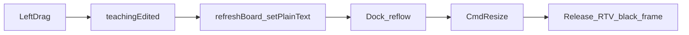

# Viewport Polish Implementation Plan

> **For agentic workers:** Follow this plan task-by-task after the Phase 0–4 lab shell. Steps use checkbox (`- [ ]`) syntax for tracking.

**Goal:** Stop left-drag black flashes, reduce aliasing/z-fighting, and align UI + viewport look with DX11-Study (dark rounded panels, W/V/P accent colors, translucent Lambert mesh + edge outlines, ground grid, cone axes).

**Architecture:** Keep Qt docks + HWND DX11 viewport + `std::thread` renderer. Polish is presentation-only: throttle UI refresh on orbit, MSAA swapchain, depth-bias debug lines, shader/material/grid visuals, Fusion + QSS.

**Tech Stack:** Same as lab shell — C++11, Qt 5.15 Widgets, D3D11, DirectXMath.

**Visual reference:** `E:\code\private\DX11-Study` — [`src/styles/main.css`](../../../DX11-Study/src/styles/main.css) `:root` palette; [`src/engine/scene.js`](../../../DX11-Study/src/engine/scene.js) `GridHelper`, translucent `MeshLambertMaterial`, `EdgesGeometry`, cone RGB axes.

## Global Constraints

- Do not change teaching state machine, row/column-major rules, JSON, or render-thread model.
- Qt docks stay opaque (cannot overlay HWND like the web page). Match web colors; do not require true panel-over-canvas transparency.
- No 8x MSAA, FXAA, rounded Win32 non-client area, PBR, shadow maps, or floating 3D “WORLD” sprites (use a Qt axis legend instead).
- Local commits per task; push when the polish pass is done (or per user preference).

## Root causes (from screenshots)

| Symptom | Cause |
|---------|--------|
| Flicker on left-drag orbit | Each mouse pixel emits `teachingEdited` → `refreshBoard()` rewrites four `QPlainTextEdit`s → dock reflow → 1px viewport resize → `CmdResize` releases RTV → black frame |
| Jagged edges | Swapchain `SampleDesc.Count = 1` |
| Z-fighting / “穿模” | Debug axes/frustum/tracker share mesh depth with no bias; origin axes pierce the center cube; wire mode shows triangle diagonals |
| Flat / rough look | Solid is a constant RGB; no ground grid; default Qt grey square widgets |

---

### Task 1: Stop flicker

**Files:**
- Modify: `src/render/D3D11Renderer.cpp` (`resize`)
- Modify: `src/ui/Dx11ViewportWidget.h` / `.cpp` (orbit flag + throttle signal)
- Modify: `src/app/MainWindow.cpp` / `.h` (throttled panel refresh)
- Modify: `src/ui/MatrixBoardPanel.cpp` (fixed min height on matrix edits)

- [ ] **Step 1:** In `D3D11Renderer::resize`, if `w == m_w && h == m_h` and RTV/DSV valid, return true without releasing RTV.
- [ ] **Step 2:** Viewport: set `m_orbiting` on LMB press; clear on release. While orbiting, `commitTeaching` only `publishState`; schedule/emit `teachingEdited` via 50 ms timer (or MainWindow timer). On release, emit immediately.
- [ ] **Step 3:** MainWindow: on throttled/edited path, `setState` panels + `refreshBoard` / `refreshTracker` as today.
- [ ] **Step 4:** Matrix `QPlainTextEdit`s: set a fixed minimum height so digit churn does not resize the central widget by 1 px.
- [ ] **Step 5:** Manual: drag viewport — no black flash; release — sliders/matrices match camera. Real window resize still works.
- [ ] **Step 6:** Commit: `Fix orbit flicker by skipping no-op resize and throttling panel refresh.`

---

### Task 2: MSAA + depth bias for debug lines

**Files:**
- Modify: `src/render/D3D11Renderer.cpp` / `.h` (sample count, depth buffer match)
- Modify: `src/render/DebugDraw.cpp` / `.h` (rasterizer / depth-stencil for lines)

- [ ] **Step 1:** After device create, `CheckMultisampleQualityLevels` for `R8G8B8A8_UNORM`; pick 4, else 2, else 1. Set swapchain + depth `SampleDesc` alike. Keep `DXGI_SWAP_EFFECT_DISCARD`.
- [ ] **Step 2:** DebugDraw: bind a rasterizer with `DepthBias` / negative `SlopeScaledDepthBias`, depth test on, `DepthWriteMask = ZERO`.
- [ ] **Step 3:** Teaching wireframe stays Back cull; outline path (Task 3) uses true edges, not triangle diagonals.
- [ ] **Step 4:** Manual: oblique view — smoother silhouettes; axes/grid less z-fight.
- [ ] **Step 5:** Commit: `Add MSAA swapchain and depth-biased debug lines.`

---

### Task 3: Viewport look (DX11-Study scene cues)

**Files:**
- Modify: `assets/shaders/unlit.hlsl`
- Modify: `src/render/D3D11Renderer.cpp` / `.h`
- Modify: `src/render/DebugDraw.cpp` / `.h`
- Modify: `src/teach/MeshBuild.cpp` / `.h` (sphere tessellation; optional edge list helper)
- Modify: `src/ui/Dx11ViewportWidget` or `MainWindow` (axis legend overlay)
- Modify: `tests/test_transforms.cpp` or mesh tests if sphere vertex counts change

- [ ] **Step 1:** Clear color `#0a0a18`.
- [ ] **Step 2:** Ground grid 20×20 at Y=0; major `#444466`, minor `#333355` (match `GridHelper` in scene.js).
- [ ] **Step 3:** Solid: Lambert + weak emissive; primary `#4a90d9` alpha ~0.9; LayoutThree companions `#38b889` / `#d98c3f`. Enable SrcAlpha / InvSrcAlpha blend.
- [ ] **Step 4:** After mesh, draw **silhouette edges** (cube: 12 edges only), color `#88ccff`.
- [ ] **Step 5:** World axes: thicker RGB lines + small cones, length ~3. Qt top-left axis legend (like `#axis-legend`); no 3D text sprites this pass.
- [ ] **Step 6:** Keep Normal / Checker / Wire. Sphere ~24×32; update CTest expectations.
- [ ] **Step 7:** Manual: translucent blue box + bright edges + grid + cone axes; three-object green/orange readable.
- [ ] **Step 8:** Commit: `Align viewport materials and helpers with DX11-Study look.`

---

### Task 4: QSS theme (DX11-Study palette)

**Files:**
- Create: `src/app/app.qss` (or embed string)
- Modify: `src/main.cpp` or `MainWindow` — `QApplication::setStyle("Fusion")` + load QSS
- Modify: `CMakeLists.txt` if copying `app.qss` next to exe
- Modify: Transform / matrix / tutorial panels lightly for World/View/Projection/MVP accent (GroupBox title or left color bar)

Palette from DX11-Study `:root`:

| Token | Hex |
|-------|-----|
| bg-deep | `#0f0f1a` |
| bg-panel | `#1a1a2e` |
| bg-section | `#16213e` |
| bg-cell | `#0d0d1a` |
| border | `#2a2a4a` |
| text | `#ccd6f6` |
| text-dim | `#8892b0` |
| highlight | `#61dafb` |
| World | `#ff6b6b` |
| View | `#4ecdc4` |
| Projection | `#f7b731` |
| MVP | `#a55eea` |

- [ ] **Step 1:** Apply Fusion + QSS: 4–6px radius on buttons, docks, spinboxes, combos; mono for matrix cells.
- [ ] **Step 2:** Demo button gold border `#f7b731`. Hover/active use `#61dafb`.
- [ ] **Step 3:** Section accents for World / View / Projection / MVP.
- [ ] **Step 4:** Manual: dark rounded chrome; docks opaque but color-matched.
- [ ] **Step 5:** Commit: `Apply DX11-Study-inspired Fusion QSS theme.`

---

### Task 5: Verify

- [ ] Drag orbit: no black flash; release syncs UI.
- [ ] Real resize still recreates buffers when size changes.
- [ ] Oblique view: smoother edges; less axis/mesh fight.
- [ ] Solid / Normal / Checker / Wire still switch correctly.
- [ ] `ctest --test-dir build --output-on-failure` PASS.
- [ ] Commit only if README or test expectations need a final tweak.

---

## Out of scope

- Teaching pipeline / JSON / column-major upload math
- True translucent docks over the D3D HWND
- Selection gizmos, 3ds Max materials, PBR, shadow maps
- Floating 3D “WORLD” sprites (legend substitutes)

## Spec / doc links

- Design: [`docs/superpowers/specs/2026-08-16-dx11-lab-teach-design.md`](../specs/2026-08-16-dx11-lab-teach-design.md)
- Phase 0–4 plan: [`docs/superpowers/plans/2026-08-16-dx11-lab-teach.md`](./2026-08-16-dx11-lab-teach.md)
- UI layout notes: [`docs/ui/01-lab-shell-layout.md`](../../ui/01-lab-shell-layout.md)
