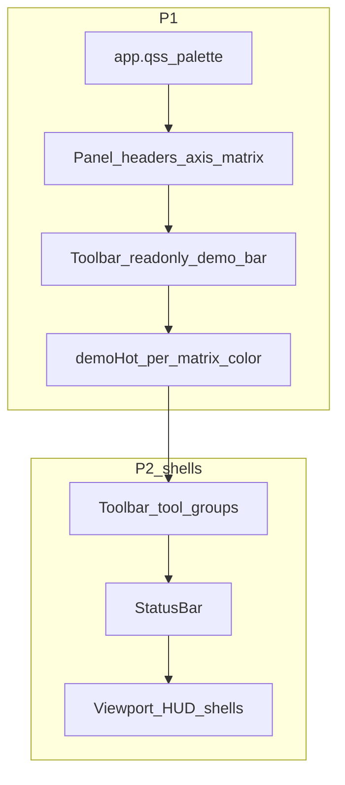

# UI Redesign Implementation Plan

> **For agentic workers:** REQUIRED SUB-SKILL: Use superpowers:subagent-driven-development (recommended) or superpowers:executing-plans to implement this plan task-by-task. Steps use checkbox (`- [ ]`) syntax for tracking. After each task, update the matching `REQ-*` **状态** in [`docs/superpowers/specs/2026-08-25-ui-redesign-design.md`](../specs/2026-08-25-ui-redesign-design.md).

**Goal:** Restyle the existing Qt dock lab shell to the `docs/ui/design` mockup palette and chrome, then add P2 empty-shell controls without breaking HWND DX11 teaching flows.

**Architecture:** Keep `QMainWindow` docks + central `Dx11ViewportWidget` over `TutorialPanel` strip. Drive almost all look-and-feel through `app.qss` and panel `objectName`s; add lightweight Qt widgets for demo-bar / status / viewport chrome. Never overlay Qt widgets on the native DXGI surface.

**Tech Stack:** C++11, Qt 5.12+ Widgets, existing Fusion + `app.qss`, Direct3D 11 (axis color literals only when aligning gizmos).

**Spec:** [`docs/superpowers/specs/2026-08-25-ui-redesign-design.md`](../specs/2026-08-25-ui-redesign-design.md)  
**Visual refs:** [`docs/ui/design/mockup.html`](../../ui/design/mockup.html), [`mockup.svg`](../../ui/design/mockup.svg)

## Global Constraints

- Color source of truth: mockup `:root` hex values copied in the spec §3 (not the older viewport-polish red/teal/gold/purple matrix table).
- Demo primary controls stay on central `TutorialPanel`; toolbar `demo-bar` is read-only sync (REQ-TB-002/003, D-03).
- P2 new controls default to **空壳** unless a task explicitly says 接线.
- No Qt widgets on `Dx11NativeSurface`; HUD only in non-native layers of `Dx11ViewportWidget` or outside the surface.
- Do not change TeachingState math, JSON schema, or render-thread model.
- C++11 / Qt 5.12-safe APIs only (`buttonClicked(int)` etc. already in tree).
- After finishing a task: set each covered `REQ-*` to `已完成` (or `不做`) in the spec, then commit.

## File map

| File | Responsibility |
|------|----------------|
| `src/app/app.qss` | Global palette, docks, group boxes, matrix accents, demoHot |
| `src/app/MainWindow.cpp` / `.h` | Toolbar demo-bar, optional status bar, shell wiring |
| `src/ui/TransformPanel.*` | World/View/Proj headers; axis-colored labels |
| `src/ui/ObjectPanel.*` | Restyle only |
| `src/ui/MatrixBoardPanel.*` | Per-matrix objectNames / demoHot property |
| `src/ui/LabPanel.*` | Card-like sections |
| `src/ui/TrackerPanel.*` | Axis-colored XYZ |
| `src/ui/TutorialPanel.*` | Keep behavior; QSS polish; expose step text for demo-bar |
| `src/ui/Dx11ViewportWidget.*` | Legend colors; P2 HUD shells |
| `src/render/DebugDraw.*` / `D3D11Renderer.*` / `AxisLabels.*` | Align axis RGB floats to spec §3.3 if visibly off |

---

### Task 1: Lock palette into `app.qss`

**REQ:** REQ-VIS-001, REQ-VIS-002, REQ-VIS-003, REQ-VIS-004, REQ-HDR-001 (QSS portion), REQ-MX-001 (QSS portion)

**Files:**
- Modify: `src/app/app.qss`
- Modify: `docs/superpowers/specs/2026-08-25-ui-redesign-design.md` (status columns)

**Interfaces:**
- Consumes: existing objectNames `sectionWorld`, `sectionView`, `sectionProjection`, `sectionMatrixW|V|P`, `sectionMVP`, `tutorialStrip`, `btnDemo`
- Produces: QSS colors matching spec §3; World/View/Proj left borders use `#EF476F` / `#06D6A0` / `#FFB703`; matrix sections use `#4CC9F0` / `#B388FF` / `#FFB703` / `#F72585`

- [ ] **Step 1:** Replace shell backgrounds (`#0f0f1a` family) with `#0E1320` / `#161B2B` / `#1D2335` / `#0C1019`; borders `#272E44`; text `#EEF1F9` / `#B3BBD1` / `#7C8499`; accent `#5B8DEF`.
- [ ] **Step 2:** Remap `sectionWorld|View|Projection` and `sectionMatrixW|V|P` / `sectionMVP` border/title colors to §3.2 / §3.4.
- [ ] **Step 3:** Retune `QFrame#tutorialStrip`, tool buttons, docks, group boxes radii (~6–10px) and padding for denser mockup look.
- [ ] **Step 4:** Build Release, run app, screenshot docks vs `mockup.html` palette.
- [ ] **Step 5:** Mark REQ-VIS-001..004 (and QSS parts of HDR/MX) `已完成` in the spec.
- [ ] **Step 6:** Commit: `Restyle app.qss to the mockup deep-blue palette and matrix keys.`

---

### Task 2: Axis-colored transform / tracker labels

**REQ:** REQ-L-001, REQ-L-002, REQ-L-003, REQ-L-004, REQ-TR-001, REQ-HDR-003 (if badges added in code)

**Files:**
- Modify: `src/ui/TransformPanel.cpp` / `.h` (as needed for label objectNames)
- Modify: `src/ui/TrackerPanel.cpp`
- Modify: `src/ui/ObjectPanel.cpp` (QSS only if needed)
- Modify: `src/app/app.qss`

**Interfaces:**
- Consumes: Transform/Tracker form labels for X/Y/Z
- Produces: objectNames or stylesheets e.g. `axisLabelX|Y|Z` with colors `#EF476F` / `#06D6A0` / `#4CC9F0`

- [ ] **Step 1:** Give Pos/Scale (and Tracker) X/Y/Z labels distinct objectNames; style in QSS.
- [ ] **Step 2:** Ensure World/View/Proj GroupBoxes keep objectNames used by Task 1.
- [ ] **Step 3:** Lightly restyle Front/Side/Top/Iso buttons if they look unfinished.
- [ ] **Step 4:** Manual: left dock + tracker show axis colors matching viewport legend intent.
- [ ] **Step 5:** Update REQ statuses; commit: `Tint transform and tracker XYZ labels with mockup axis colors.`

---

### Task 3: Matrix demoHot per-key glow

**REQ:** REQ-MX-001, REQ-MX-002, REQ-MX-003, REQ-HDR-002

**Files:**
- Modify: `src/ui/MatrixBoardPanel.cpp` / `.h`
- Modify: `src/app/app.qss` (`demoHot` rules per section)

**Interfaces:**
- Consumes: existing `setDemoFocus` / dynamic property `demoHot`
- Produces: QSS like `QGroupBox#sectionMatrixV[demoHot="true"]` with `#B388FF` glow (and analogs for W/P/MVP)

- [ ] **Step 1:** Confirm each matrix GroupBox has stable objectName W/V/P/MVP.
- [ ] **Step 2:** Replace single yellow `demoHot` wash with per-objectName color rules from §3.4.
- [ ] **Step 3:** Run demo tour; verify focus color follows `demoMatrixFocus`.
- [ ] **Step 4:** Update REQ statuses; commit: `Color demo matrix focus with per-board mockup keys.`

---

### Task 4: Viewport legend + gizmo color alignment

**REQ:** REQ-VP-001, REQ-VP-002

**Files:**
- Modify: `src/ui/Dx11ViewportWidget.cpp` (HUD swatches / caption style)
- Modify: `src/render/DebugDraw.cpp` and/or `D3D11Renderer.cpp` / `AxisLabels.cpp` if axis floats differ visibly from §3.3

**Interfaces:**
- Consumes: teaching `demoPlaying` / `tutorialStep` for caption
- Produces: legend swatches `#EF476F` / `#06D6A0` / `#4CC9F0` / `#F72585`; keep Chinese axis copy unless plan step explicitly switches

- [ ] **Step 1:** Update HUD inline stylesheet / swatch hex to §3.3.
- [ ] **Step 2:** Keep single-line demo caption; tint with accent.
- [ ] **Step 3:** If gizmos still look like old `#ff4444` family, update render literals to match §3.3.
- [ ] **Step 4:** Manual compare legend vs 3D axes; update REQ; commit: `Align viewport axis legend and gizmos with mockup axis colors.`

---

### Task 5: Lab cards + tutorial QSS

**REQ:** REQ-LAB-001, REQ-LAB-002, REQ-TU-001, REQ-TU-002, REQ-TU-003

**Files:**
- Modify: `src/ui/LabPanel.cpp` (objectNames for Device/Shader/Rasterizer/CB cards if missing)
- Modify: `src/ui/DebugLogPanel.cpp` / QSS only as needed
- Modify: `src/ui/TutorialPanel.cpp` / `app.qss`

**Interfaces:**
- Consumes: existing LabPanel controls and TutorialPanel behavior
- Produces: card-like group styling; tutorial buttons match new tool language; behavior unchanged

- [ ] **Step 1:** Assign objectNames to Lab sections; style as cards in QSS (vertical stack OK).
- [ ] **Step 2:** Restyle Debug log chrome.
- [ ] **Step 3:** Verify TutorialPanel still disables prev/next while demo plays; polish `#btnDemo`.
- [ ] **Step 4:** Update REQ; commit: `Card-style Lab sections and polish tutorial strip controls.`

---

### Task 6: Read-only toolbar demo-bar

**REQ:** REQ-TB-001, REQ-TB-002, REQ-TB-003, REQ-TU-004

**Files:**
- Modify: `src/app/MainWindow.cpp` / `.h`
- Modify: `src/ui/TutorialPanel.h` / `.cpp` (optional getters for title/body/index)
- Modify: `src/app/app.qss`

**Interfaces:**
- Consumes: `m_teaching.tutorialStep`, `demoPlaying`, `tutorialStepAt`
- Produces: toolbar widget showing `N/8`, title, ellipsized body; no primary prev/next/demo actions on the bar (disabled or omitted)

- [ ] **Step 1:** Add a `QWidget` demo-bar to Teach toolbar (labels + optional disabled chevrons).
- [ ] **Step 2:** On `syncTeaching` / demo tick / tutorial apply, refresh demo-bar text from `tutorialStepAt`.
- [ ] **Step 3:** Keep TutorialPanel as sole control surface for step/demo.
- [ ] **Step 4:** Manual: play demo — bar text updates; clicking disabled chevrons does nothing.
- [ ] **Step 5:** Update REQ; commit: `Add a read-only toolbar demo bar synced to the tutorial strip.`

---

### Task 7: P2 toolbar tool-group shells

**REQ:** REQ-TB-004, REQ-TB-005, REQ-TB-006, REQ-TB-007

**Files:**
- Modify: `src/app/MainWindow.cpp` / `.h`
- Modify: `src/app/app.qss`

**Interfaces:**
- Consumes: none (no TeachingState writes)
- Produces: inactive `QToolButton` groups matching mockup titles; clicks no-op or status tip “未实现”

- [ ] **Step 1:** Add tool groups: navigate (Q/W/E/R labels), shading, mesh, capture (record/perf/screenshot).
- [ ] **Step 2:** Style as `.tool-group` equivalents in QSS.
- [ ] **Step 3:** Ensure clicks do not mutate teaching/lab state.
- [ ] **Step 4:** Update REQ; commit: `Add empty toolbar tool groups from the UI mockup.`

---

### Task 8: P2 status bar shell

**REQ:** REQ-SB-001 (REQ-SB-002 deferred unless trivial)

**Files:**
- Modify: `src/app/MainWindow.cpp` / `.h`
- Modify: `src/app/app.qss` (status bar colors)

**Interfaces:**
- Consumes: optional existing adapter name from DebugLogPanel (display-only)
- Produces: `QStatusBar` segments with placeholder strings from mockup

- [ ] **Step 1:** `statusBar()->show()` with permanent widgets: Device, SwapChain, Backbuffer, Tick, DPI, etc.
- [ ] **Step 2:** Fill with static placeholders; optionally show adapter string if already available.
- [ ] **Step 3:** Do not implement REQ-SB-002 polling unless leftover time; leave `未开始` or split follow-up.
- [ ] **Step 4:** Update REQ-SB-001; commit: `Add a placeholder engine status bar under the main window.`

---

### Task 9: P2 viewport HUD shells

**REQ:** REQ-VP-003 .. REQ-VP-008, REQ-HDR-004, REQ-LAB-003

**Files:**
- Modify: `src/ui/Dx11ViewportWidget.cpp` / `.h`
- Modify: `src/ui/LabPanel.cpp` (CB hex placeholder widget)
- Modify: `src/app/app.qss` or inline styles consistent with mockup
- Optional: `TransformPanel` / matrix panel header icon buttons (no collapse logic) for REQ-HDR-004

**Interfaces:**
- Consumes: layout around `m_hud` + `m_surface` only — shells must not be children of `Dx11NativeSurface`
- Produces: Navigator widget, floating tool column, perf strip, toast label, bottom pills, cursor info — all non-functional or static

- [ ] **Step 1:** Extend viewport non-native layout (overlay frames anchored TL/TR/BR/BL) without covering the native surface’s hit target more than necessary; prefer margins beside/above surface.
- [ ] **Step 2:** Add empty Navigator + `vp-tools` buttons + perf/toast/pills/cursor labels with mockup copy.
- [ ] **Step 3:** Add CB hex `QPlainTextEdit` read-only placeholder in LabPanel.
- [ ] **Step 4:** Optional: panel header icon buttons that do nothing (REQ-HDR-004); leave REQ-HDR-005 `未开始`.
- [ ] **Step 5:** Manual: resize window; shells remain visible; orbit still works on surface.
- [ ] **Step 6:** Update REQ statuses; commit: `Scaffold mockup viewport HUD and lab hex shells without wiring.`

---

### Task 10: Spec progress pass + doc sync

**REQ:** any still `进行中`; verify OUT-* remain `不做`

**Files:**
- Modify: `docs/superpowers/specs/2026-08-25-ui-redesign-design.md`
- Modify: `docs/ui/01-lab-shell-layout.md` if status bar / demo-bar need a one-line mention

- [ ] **Step 1:** Walk every `REQ-*` row; fix stale statuses.
- [ ] **Step 2:** Tick P1/P2 acceptance checklists in the spec that are truly met.
- [ ] **Step 3:** Commit: `Mark completed UI redesign requirements after the shell pass.`

---

## Progress tracking cheat sheet

| When you… | Also… |
|-----------|--------|
| Start a task | Set its `REQ-*` to `进行中` |
| Finish a task | Set to `已完成`; check task boxes above |
| Drop scope | Set to `不做`; note reason in spec §9 |
| Defer wiring | Leave P2 `接线` rows `未开始`; empty shells can still be `已完成` |

## Out of scope reminders

- REQ-OUT-001..003 stay `不做`.
- Do not replace docks with an HTML shell.
- Do not implement record/screenshot encoders or a second swapchain Navigator.
