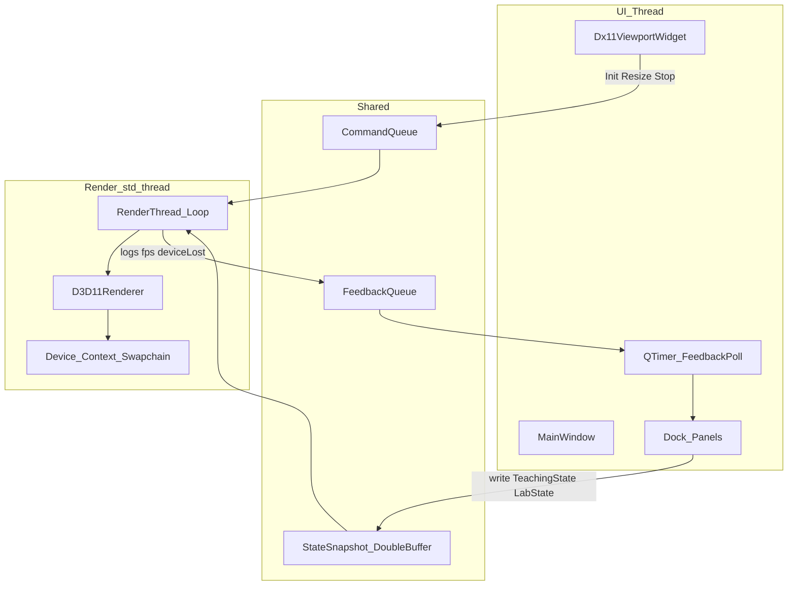

# 3DEditMax 第一期设计：DX11 实验台与矩阵教学

日期：2026-08-16  
状态：Phase 0–4 已落地；视口/UI 抛光见下方 follow-up 计划  
实现计划：[`docs/superpowers/plans/2026-08-16-dx11-lab-teach.md`](../plans/2026-08-16-dx11-lab-teach.md)  
视口抛光计划：[`docs/superpowers/plans/2026-08-16-viewport-polish.md`](../plans/2026-08-16-viewport-polish.md)（对齐 DX11-Study 视觉：停闪、MSAA、半透明立方体+轮廓边、网格、深蓝圆角 QSS）  
相邻参考：`E:\code\private\DX11-Study`（网页教学能力与视觉）、`E:\code\private\ProRes`（Qt HWND + D3D11 嵌入，仅窗口边界）

## 1. 目标与非目标

**目标：** 用 C++11 + Qt 5.15.2 QWidget + 真 Direct3D 11 做一台「DX11 实验台」。学生在中央视口里看到真实 GPU 画面，在停靠面板里调节 World / View / Projection，对照矩阵数值、视锥、坐标追踪，并逐步打开 Device / Shader / Rasterizer / Constant Buffer / Debug 层观察。

**成功标准：**

- 本机 MSVC 能配置、编译、运行一个窗口；中央客户区由 DXGI Swapchain Present，而不是 `QPainter`。
- 调节 TRS / 相机 / 投影后，视口与矩阵看板同时变化，看板默认列主序且与 Constant Buffer 上传一致。
- Debug 构建能看到 D3D11 InfoQueue 消息出现在日志面板（经反馈队列，不经 `invokeMethod`）。
- 教学能力覆盖 DX11-Study 的学习闭环（模型、材质、视锥、追踪、脚本、演示、JSON），界面不复制该网页。

**非目标（本 spec 不做）：**

- 选择集、完整 Gizmo（旋转/缩放柄）、撤销栈、材质编辑器、3ds Max 文件格式。主物体世界轴平移手柄是 follow-up 例外，见 §14。
- 通用 Scene / Node 场景图
- `QThread` / `QtConcurrent` 渲染
- 自动截图对比回归
- 跨平台（仅 Windows + MSVC）

## 2. 产品形态

实验台外壳（Lab shell）：`QMainWindow` + 可拖动 `QDockWidget`。矩阵教学是其中一组面板，不是另一套程序。

引擎保持精简：若干教学物体（网格 id + TRS）+ 一台相机 + 一套投影。没有节点树、没有组件系统。

界面定稿见 [`docs/ui/01-lab-shell-layout.md`](../../ui/01-lab-shell-layout.md) 与 [`docs/ui/lab-shell-layout.svg`](../../ui/lab-shell-layout.svg)。

## 3. 分期

同一架构上依次填满，不另起炉灶。

| 阶段 | 可运行结果 |
|------|------------|
| 0 | 窗口、HWND Swapchain、独立渲染线程、彩色立方体、Debug 日志面板 |
| 1 | World / View / Projection 调节、矩阵看板、行列主序切换、视口轨道相机 |
| 2 | 视锥线框、坐标追踪、立方体/球/柱、单/三物体、四材质 |
| 3 | 8 步教学脚本、演示播放、JSON 导入导出 |
| 4 | Shader / Input Layout 切换、填充/剔除/深度、CB 观察 |

编辑器能力属于后续独立 spec。

## 4. 架构



### 4.1 线程

- UI 线程：创建/销毁 `QWidget` 与 HWND；改 `TeachingState` / `LabState`；把可拷贝快照写入双缓冲 back；把命令推进 `CommandQueue`。
- 渲染线程：`std::thread`（C++11）。创建 `ID3D11Device`、`ID3D11DeviceContext`、`IDXGISwapChain`。只有该线程使用 Immediate Context。
- 禁止：`QThread`、`QtConcurrent`、`moveToThread`。渲染线程内不创建、不调用 `QWidget`。
- 回传只用 `FeedbackQueue` + UI 侧 `QTimer` 轮询。不使用 `QMetaObject::invokeMethod`。

命令（低频，`std::mutex` + `std::queue`）：`Init(hwnd, w, h)`、`Resize(w, h)`、`ReloadShader`、`Stop`。

每帧状态：`StateSnapshot` 双缓冲。UI 写 back 并 `atomic` 标记 dirty；渲染线程 Swap 出一份 POD 快照后绘制。

生命周期：

1. `showEvent`：确保 `winId()` 有效，启动线程，推 `Init`。
2. `resizeEvent`：推 `Resize`。宽高 ≤ 0 时渲染线程跳过 `Present`，不拆 Device。
3. `hideEvent` / 析构：推 `Stop`，`join`，再让 Qt 拆 HWND。禁止 HWND 已毁仍 `Present`。

### 4.2 HWND 嵌入

与 ProRes `VideoWidget` 相同的窗口边界，不同的呈现循环。`Dx11ViewportWidget` 外层是普通 `QWidget`：

- **顶栏 HUD（非 native）：** 轴图例（红 X 左右、绿 Y 上下、蓝 Z 前后、品红追踪点）与演示词条。不能把 Qt 控件叠在 Swapchain 上，否则会被 D3D 盖住。
- **子控件 `Dx11NativeSurface`：** `Qt::WA_NativeWindow`、`WA_DontCreateNativeAncestors`、`WA_OpaquePaintEvent`、`WA_NoSystemBackground`；`paintEngine()` 返回 `nullptr`；`winId()` 转为 `HWND` 交给 `DXGI_SWAP_CHAIN_DESC.OutputWindow`。鼠标轨道/平移/轴拖都在该子控件上。
- 不把 D3D 画面读回 `QImage`，不用 `QPainter` 覆盖视口。

视口交互：左键点物体世界轴手柄则沿该轴平移 `objects[0]`；点空白处轨道旋转；右键抓取场景式平移；滚轮推拉。拖动中不刷新矩阵看板，松开再同步。

图示：[`docs/ui/thread-and-hwnd.svg`](../../ui/thread-and-hwnd.svg)。

### 4.3 数学

- 使用 DirectXMath（`XMMatrix*`）。
- 看板默认列主序，可切行主序；切换只影响展示字符串，不转置上传。
- CPU 将 `XMMATRIX` 经 `XMStoreFloat4x4` 写入 Constant Buffer，按 DX11 / HLSL 列主序习惯。
- 公式注释按 MSDN 风格（`XMMatrixLookAtLH`、`XMMatrixPerspectiveFovLH` 等）。
- 渲染坐标系：DX11 左手、Y-up。第一期不做 Web 右手对照开关（网页那项后置，避免和真 LH 管线打架）。

## 5. 模块与目录

```
src/app/           MainWindow
src/ui/            Dx11ViewportWidget、各 QDockWidget 面板
src/core/          TeachingState、LabState、StateSnapshot、显示用矩阵格式化
src/render/        RenderThread、CommandQueue、FeedbackQueue、D3D11Renderer、
                   MeshGpu、ShaderSet、ConstantBuffer、DebugDraw
src/teach/         由参数构建 W/V/P、坐标追踪、教学脚本、演示、JSON
assets/shaders/    HLSL 源文件，运行时 D3DCompile
tests/             无 GPU 的 CTest（teach 数学、追踪、JSON）
docs/ui/           界面示意图
docs/superpowers/  本 spec 与实现计划
```

依赖方向：`app` → `ui` → `core`；`render` 读 `core` 快照；`teach` 为纯 CPU，被 `ui` 与 `render` 使用。`ui` 不链接 D3D 绘制调用；`render` 不包含 Qt 头（队列与快照为标准库类型；`HWND` 仅以 `void*` 或 `<windows.h>` 出现在 render 的 viewport 桥接处）。

`Dx11ViewportWidget` 是唯一允许同时看见 Qt 与 `HWND` 的 UI 文件。命令结构体在 `src/render/CommandQueue.h` 中用 `HWND`（包含 `<windows.h>`）。Widget 把 **native 子控件** 的 `winId()` 转成 `HWND` 推进队列，不持有 `ID3D11Device`。`src/ui` 下其余面板不包含 Windows / D3D 头。

## 6. 数据

### 6.1 TeachingState（UI 可写）

- 物体数组（最多 3）：`meshId`（Cube=0, Sphere=1, Cylinder=2）、平移、欧拉角（度，Pitch/Yaw/Roll）、缩放。
- 布局：`One` 或 `Three`。`One` 只绘制 index 0。
- 材质：`Solid`、`Normal`、`Checker`、`Wire`。
- 相机：距离、俯仰、方位（弧度对内、度对外）。
- 投影：`Perspective` / `Ortho`、FOV（度）、aspect（可 `followViewport`）、near、far。
- 追踪点：模型空间 `XMFLOAT3`；视口品红线框八面体标出其世界位置（默认立方体角 `0.5,0.5,0.5`）。
- 脚本/演示：当前步、是否播放。`DemoPlayer` 依次套用 8 个 `tutorialStepAt(i)`（每步约 2s），HUD 显示 `N/8`、标题与正文；不是 8 秒转相机。

### 6.2 LabState（UI 可写）

- 当前 VS/PS 变体名（阶段 0 仅 `unlit`）。
- 填充：Solid / Wireframe；剔除：None / Back / Front；深度：开/关（阶段 4，阶段 0 用默认 Solid+Back+DepthOn）。
- Debug 层：希望开启（Debug 构建默认开）。

### 6.3 StateSnapshot

`TeachingState` + `LabState` + 视口宽高的值拷贝。无指针、无 Qt 类型。渲染线程不得写回 Teaching/Lab 状态。

### 6.4 Constant Buffer（每物体或每帧）

```
cbuffer FrameCB : register(b0) {
  float4x4 world;
  float4x4 view;
  float4x4 proj;
  float4x4 worldViewProj;
};
```

阶段 0 可以只传 `worldViewProj`；阶段 1 起四矩阵都上传，供看板与 shader 对照。

### 6.5 Feedback 条目

`kind`：`Log`、`Error`、`Warn`、`Fps`、`DeviceLost`、`DeviceOk`。  
`text`：UTF-8 `std::string`。  
`ms`：可选帧耗时。

## 7. 渲染

- 设备：优先硬件适配器；Debug 构建加 `D3D11_CREATE_DEVICE_DEBUG`，若本机无调试运行时则回退并 `Warn`。
- Swapchain：windowed，`DXGI_FORMAT_R8G8B8A8_UNORM`，`DXGI_SWAP_EFFECT_DISCARD` 可作阶段 0；有深度缓冲。
- `MakeWindowAssociation(hwnd, DXGI_MWA_NO_ALT_ENTER)`。
- 网格：CPU 生成顶点（位置+法线+uv），上传不可变 VB/IB。
- 阶段 0 着色器：本地坐标着色或纯色，足以看出立方体在转。
- DebugDraw（阶段 2）：视锥线、轴、追踪点。用线列表，独立小 pipeline。
- 丢设备（`DXGI_ERROR_DEVICE_REMOVED` / `DEVICE_RESET`）：释放 RTV/Swapchain，按原 HWND 重建；失败则停绘并 `DeviceLost`。
- 着色器编译失败：保留上一份可用 shader，全文进 `Error` 日志。
- 第一期不做 deferred context、不做多线程录制命令列表。

## 8. 教学逻辑（`teach`）

纯函数，便于 CTest：

- `BuildWorld(trs)` → `XMMATRIX`（缩放→旋转→平移，LH）。
- `BuildView(distance, pitch, yaw)` → `XMMatrixLookAtLH`（目标世界原点，上向量 +Y）。
- `BuildProjection(desc, aspect)` → `XMMatrixPerspectiveFovLH` 或正交。
- `TrackPoint(pModel, w, v, p)` → world/view/clip/ndc 各点（透视除法后）。
- 脚本 8 步：与 DX11-Study 同序（坐标空间 → World → View → Projection → MVP → 对照），文案可重写，不绑定网页 DOM。
- JSON：只序列化 `TeachingState` 教学字段（TRS、相机、投影、模型、材质、追踪点）。不序列化 HWND、不序列化 GPU 句柄。

## 9. 错误处理

- Device/Swapchain 创建失败：反馈 `Error`，UI 状态栏提示，进程不崩溃，视口保持空。
- 无调试运行时：回退普通 Device，一条 `Warn`。
- 宽高 ≤ 0：跳过 Present。
- Widget 析构顺序：Stop → join → Qt 拆 HWND。
- 命令队列不做容量上限（命令低频）。快照以最新为准，允许丢中间帧状态。

## 10. 测试

- CMake `enable_testing()` + CTest。
- 无 GPU：`BuildWorld` / `BuildView` / `BuildProjection` 与手算或 DirectXMath 期望对照；`TrackPoint` 单位立方体角点；JSON 往返。
- GPU/窗口：每阶段手工清单（见实现计划）。不上自动截图。

## 11. 构建与语言

- CMake ≥ 3.16，`CMAKE_CXX_STANDARD 11`，`CMAKE_CXX_EXTENSIONS OFF`。
- Qt 5.15 Widgets，`QT_DIR` 环境变量（与 ProRes 相同解析：去掉末尾 `bin`）。
- 链接：`Qt5::Widgets`、`d3d11`、`dxgi`、`d3dcompiler`。
- C++11：不用 `std::make_unique`（C++14）、`std::optional`。可用 `std::unique_ptr`、`std::thread`、`std::mutex`、`std::atomic`、`std::condition_variable`。需要时在 `core` 提供 `make_unique` 两行模板。
- 生成器：Ninja 或 VS 2019/2022 x64。

## 12. Git

远程：`git@github.com:LoveCicada/3DEditMax.git`。每完成一个子任务 commit 并 push。不改 git config，不 force push。

## 13. 自检

- 无 TBD/TODO 要求。Web RH 对照明确后置，不留悬空开关。
- 架构、线程、HWND、数学与分期一致。
- 范围是单一产品的五个阶段，实现计划按阶段拆任务，仍是一个可运行程序。
- 「行列主序」只影响展示；「渲染线程」不用 Qt 线程；「回传」只用轮询。这三处不允许第二种解释。

## 14. Follow-up：视口与 UI 抛光（对齐 DX11-Study）

Phase 0–4 功能落地后，按用户反馈增加抛光计划（不改架构）：

| 问题 | 方向 |
|------|------|
| 左键拖视口闪烁 | 无尺寸变化跳过 `ResizeBuffers`；拖动中节流面板/看板刷新 |
| 锯齿 / 穿模 | Swapchain 4x MSAA；Debug 线 depth bias、不写深度 |
| 模型简陋 | 半透明 Lambert、轮廓边、地面网格、锥形 RGB 轴（对照 DX11-Study `scene.js`） |
| UI 粗糙 | Fusion + QSS：DX11-Study 色板、圆角、W/V/P/MVP 分色 |
| 右键平移方向 | 3ds Max 式抓取场景：内容跟随光标；公式见 pan 计划 |
| 轴图例被 HWND 盖住 | 视口拆成顶栏 Qt HUD + native 子控件；红 X / 绿 Y / 蓝 Z / 品红追踪点 |
| 粉色线框八面体 | Tracker 追踪点（默认立方体角 0.5,0.5,0.5），不是坐标轴锥体 |
| 沿轴拖模型 | 主物体世界轴平移手柄；左键点轴拖、点空处仍轨道旋转 |
| 演示无词条 | 「演示」依次播放 8 个教学步（每步约 2s），HUD 显示 N/8、标题与正文 |

约束：停靠栏不叠在 HWND 上做真半透明；不做 PBR / 漂浮 3D 字。完整选择集 Gizmo / 旋转缩放柄仍不做，仅世界轴平移。

详细任务见 [`docs/superpowers/plans/2026-08-16-viewport-polish.md`](../plans/2026-08-16-viewport-polish.md)、[`docs/superpowers/plans/2026-08-16-viewport-pan-layout.md`](../plans/2026-08-16-viewport-pan-layout.md)。
