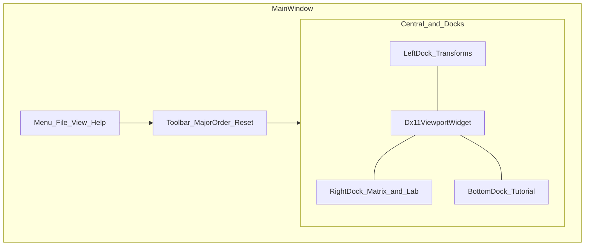

# 实验台界面布局

定稿：IDE 式停靠（`QMainWindow` + `QDockWidget`），不照搬 DX11-Study 网页。可交互位图见 [lab-shell-layout.svg](lab-shell-layout.svg)，线程关系见 [thread-and-hwnd.svg](thread-and-hwnd.svg)。

## 主窗口分区

| 区域 | Qt 角色 | 内容 | 填满阶段 |
|------|---------|------|----------|
| 顶栏菜单 | `QMenuBar` | 文件（JSON 导入/导出）、视图（重置、面板显隐）、帮助 | 0 菜单骨架；3 接通 JSON |
| 工具条 | `QToolBar` | 行列主序切换、全部重置 | 1 |
| 中央 | `QMainWindow::setCentralWidget` | `Dx11ViewportWidget`（HWND + DX11 Swapchain） | 0 |
| 左停靠 | `Left` | World / View / Projection 分组，模型与材质 | 1 变换；2 模型材质 |
| 右上停靠 | `Right` | 矩阵看板 W / V / P / MVP | 1 |
| 右中停靠 | `Right` | 坐标追踪 | 2 |
| 右下停靠 | `Right` | DX11 Lab：Device、Shader、Rasterizer、CB、Debug 日志 | 0 日志；4 其余 |
| 底停靠 | `Bottom` | 教学脚本步进、演示播放 | 3 |

用户可拖动停靠、关闭面板；`View` 菜单恢复默认布局。第一期不持久化停靠布局到磁盘。

## 默认尺寸（1920×1080 参考）

- 左栏约 320px，右栏约 380px，底栏约 160px，其余给视口。
- 最小窗口 1280×720；视口最小 320×180。

## 左栏控件（阶段 1–2）

**World：** 平移 X/Y/Z，旋转 Pitch/Yaw/Roll（度），缩放（均匀 + 分轴）。  
**View：** 距离、俯仰、方位，正视/侧视/俯视/等轴测预设。  
**Projection：** 透视/正交、FOV、宽高比（可跟随视口）、Near/Far。  
**物体：** 立方体/球/柱，单物体/三物体，纯色/法线/棋盘/线框。

## 右栏看板（阶段 1–2）

每个 4×4 用等宽字体显示 16 个 float，默认**列主序**（与 HLSL `float4x4` / DirectXMath 一致），工具条可切行主序（只改展示，不改上传）。选中矩阵时显示对应 MSDN 风格公式短注。

## 交互原则

- 视口吃鼠标：左键轨道旋转相机，右键平移（绕 `camTarget`），滚轮推拉距离（写入 `TeachingState`，渲染线程只读快照）。详见实现计划 [`docs/superpowers/plans/2026-08-16-viewport-pan-layout.md`](../superpowers/plans/2026-08-16-viewport-pan-layout.md)。
- 面板滑条与视口操作写同一份状态，避免两套相机。
- 渲染线程不创建、不调用 `QWidget`。
